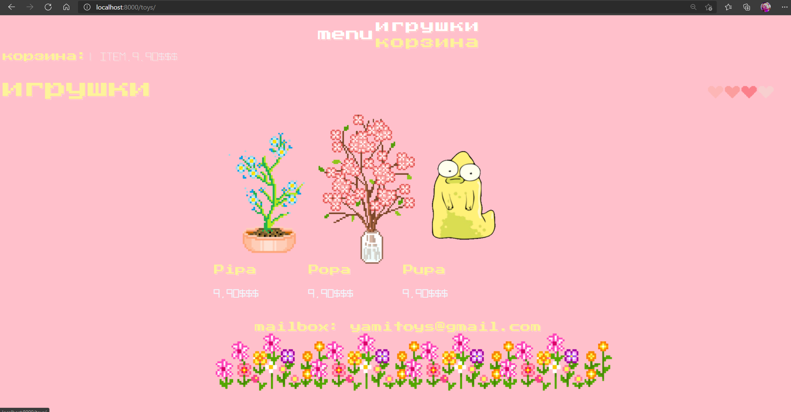
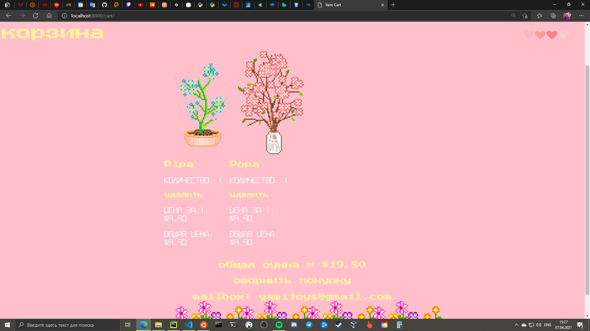
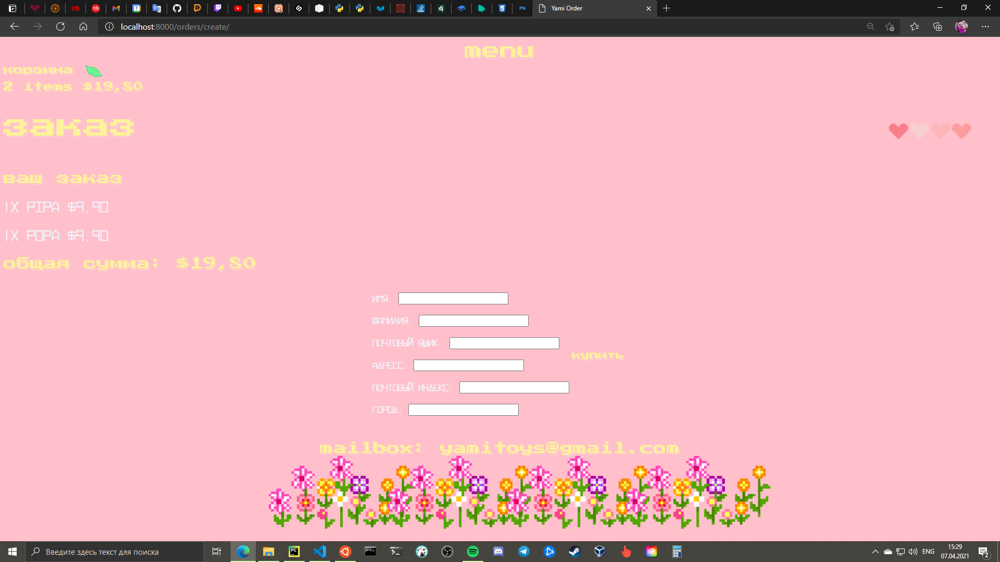

# (ﾉ◕ヮ◕)ﾉ*:･ﾟ✧ Yami Toys ✧ﾟ･: *ヽ(◕ヮ◕ヽ)
### RU
>Yami Toys(яами тойс) - кьют веб-сайт игрушек. 
>Мой первый мини-проект, который посвящен веб-сайту игрушек. 
>Основа сайта = язык программирования Python + Django Framework (｡◕‿◕｡)
### EN
> Yami Toys is a toy website. 
> My first mini project, which is about a toy website. 
> Based on the Python programming language and the Django Framework (｡◕‿◕｡)
## YAMI
### toys (￣▽￣)

### details ٩(◕‿◕)۶

### cart (≧◡≦)

